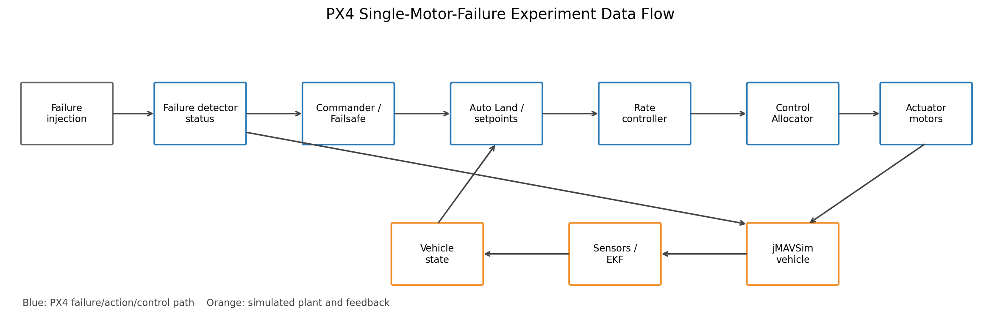
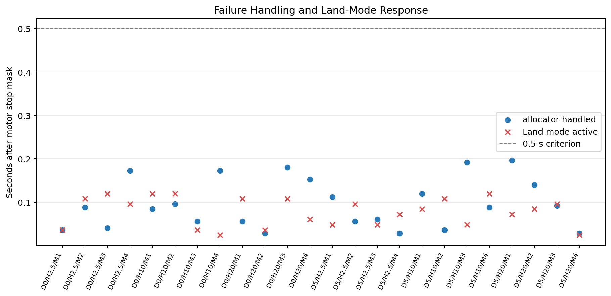
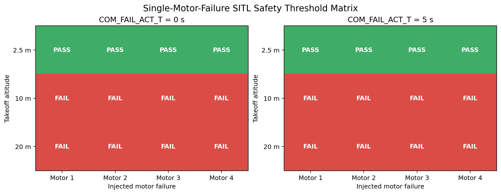
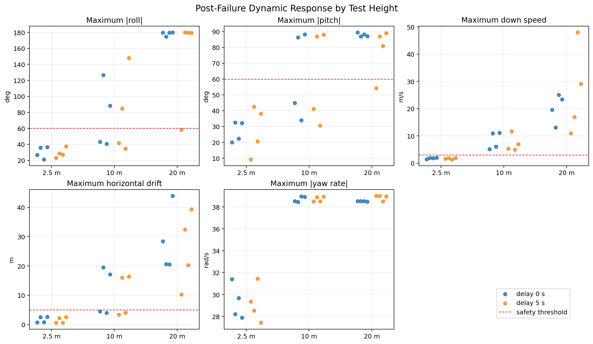
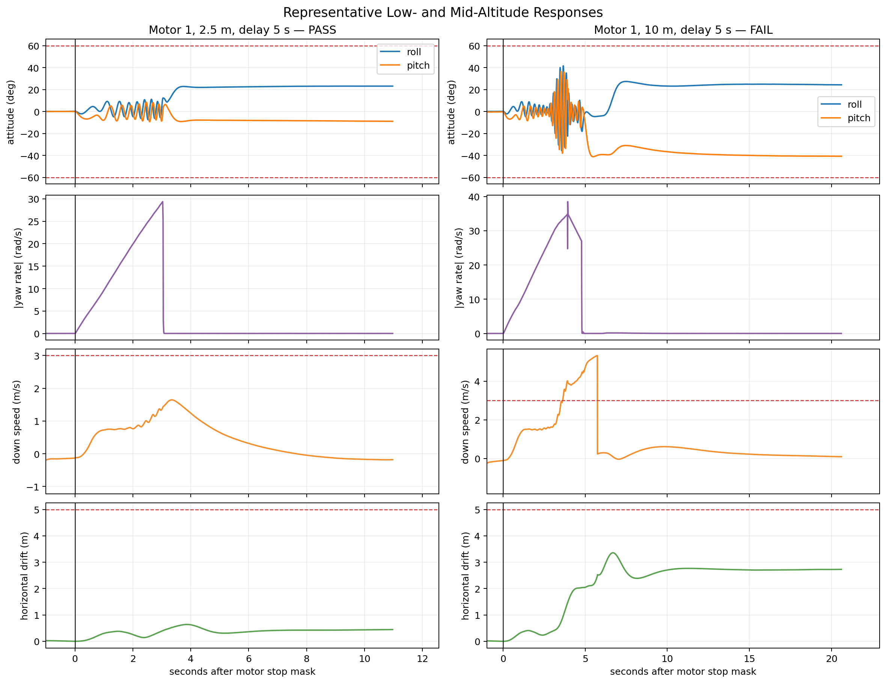

# Quadrotor Three-Motor Emergency Landing: A PX4 Degraded-Landing Experiment

> **Important notice**
>
> This is an exploratory PX4 jMAVSim SITL experiment, not a fault-tolerant
> flight-control solution ready for real hardware. "Protection" here means
> that, after one motor stops, the system attempts a degraded Land procedure
> with the other three motors. It does not provide power redundancy, and it
> does not include the real fault detection, structural validation, sensor
> reliability, or cross-airframe testing required for a safety-critical
> implementation.

## 1. Why I ran this experiment

A conventional quadrotor has four independent lift sources. After any one
motor stops, the three remaining motors generally cannot preserve full roll,
pitch, yaw, and collective-thrust control at the same time.

This experiment therefore does not try to recover a normal hover or continue
the mission. Its goals are deliberately limited:

1. Identify the stopped motor correctly.
2. Remove that motor from control allocation.
3. Switch immediately to Land.
4. Give up absolute-heading control and allow yaw-axis rotation.
5. Prioritize roll, pitch, and descent control in an attempt to reduce impact
   energy.

A more accurate description is a **degraded three-motor emergency landing**,
not "normal flight after losing a motor."

The experimental code is available on my personal branch:

<https://github.com/amovlgf/PX4-Autopilot/tree/dev/power-redundancy-protection>

The formal 24-case matrix used this firmware revision:

```text
f5bba53c2a53c0f7d7820341c19e67e6c6f92819
```

## 2. The modified failure-handling path

The complete data flow is shown below:



### 2.1 Feed an injected stopped motor into the failure path

PX4 failure injection produces a `motor_stop_mask`. With the experimental
change, the Commander failsafe flag reports a motor failure when either
`fd_motor` or `motor_stop_mask` is non-zero:

```cpp
fd_motor_failure = fd_status.fd_motor || fd_status.motor_stop_mask != 0;
```

This addresses a mismatch in which the simulator had already stopped a motor,
but the failsafe and control-allocation paths did not use the same failure
source.

The formal matrix uses software failure injection. It validates the handling
path after a failure flag exists; it does not prove that real ESC telemetry,
rotor-speed estimation, or current monitoring can reliably detect an actual
motor failure.

### 2.2 Remove the correct motor from control allocation

With `CA_FAILURE_MODE=1`, Control Allocator accepts only the first
single-motor failure. When `motor_failure_mask` is unavailable, it falls back
to `motor_stop_mask`. It then:

- updates `handled_motor_failure_mask`;
- rebuilds the effectiveness matrix;
- marks the stopped motor's actuator setpoint as unavailable for allocation;
- publishes the motor mask that it actually handled.

The matrix analysis compares the injected `motor_stop_mask` with the
allocator's `handled_motor_failure_mask`. This prevents a mapping error such
as "Motor 1 was injected, but Motor 4 was removed" from looking like a valid
protection response.

### 2.3 Enter Land immediately after a quadrotor motor failure

The experiment uses:

```text
CA_FAILURE_MODE=1
CA_ROTOR_COUNT=4
COM_ACT_FAIL_ACT=2
```

For this combination, the motor-failure action is marked as non-deferrable,
while takeover through a mode switch remains allowed. As a result, even when
`COM_FAIL_ACT_T` is set to 5 seconds, a quadrotor single-motor failure triggers
Land immediately instead of waiting for the global failsafe-action delay.

This is why the matrix tests both `COM_FAIL_ACT_T=0 s` and `5 s`.

### 2.4 Release heading hold in the Land task

When the vehicle is a quadrotor, the current task is Land, and exactly one
motor has failed, the automatic flight task applies:

```cpp
_yaw_setpoint = NAN;
_yawspeed_setpoint = 0.f;
```

This does not command the vehicle to stop rotating. It removes the demand to
track an infeasible absolute heading. The vehicle can still spin rapidly with
three propellers, but the controller can use more of its limited authority for
roll, pitch, and descent.

### 2.5 Enter a degraded rate-control mode

After detecting a single-motor failure, the multicopter rate controller:

- uses the current yaw rate as the yaw-rate target;
- resets the yaw integrator;
- retains the existing yaw low-pass filter;
- limits yaw torque to `±0.15`.

The value `0.15` is currently an experimental constant, not a parameter tuned
across different airframes. This is one major reason the implementation must
not be transferred directly to real hardware.

## 3. How the code is split

For easier review and reproduction, the personal branch separates the work
into focused commits:

| Commit | Content |
|---|---|
| `2b24c9f163` | Degraded three-motor emergency-landing control |
| `4911da2819` | Control Allocation, Failsafe, and MAVSDK test sources |
| `64d471f428` | Matrix runner, ULog extraction, validation, and plotting |
| `10b4c7be7e` | Standard MAVLink parameter and command protocols |
| `341fe61da9` | Recovery support for consecutive cases in one SITL session |
| `f5bba53c2a` | A fresh visible jMAVSim session for every matrix case |

Later commits add documentation and derived test evidence only; they do not
change the flight-control code used by the formal matrix.

## 4. Test matrix

The matrix covers every combination of:

- failed motor: Motor 1, 2, 3, and 4;
- takeoff altitude: 2.5 m, 10 m, and 20 m;
- `COM_FAIL_ACT_T`: 0 s and 5 s.

In total:

```text
4 motors × 3 heights × 2 delays = 24 cases
```

Each case uses these key parameters:

```text
SYS_FAILURE_EN=1
FD_ACT_EN=0
MC_AIRMODE=1
CA_FAILURE_MODE=1
CA_ROTOR_COUNT=4
COM_ACT_FAIL_ACT=2
```

Before injecting the failure, the automated runner requires:

- altitude within 0.6 m of the target;
- total three-dimensional speed below 1 m/s;
- both conditions to remain true for two seconds.

It then uses `MAV_CMD_INJECT_FAILURE` to set the selected motor to `OFF`.

## 5. Why every case restarts jMAVSim

Early testing ran multiple cases in the same jMAVSim world. After a
three-motor landing, the vehicle could remain on the ground at a large tilt
angle. The next test then inherited that attitude, causing preflight rejection
or making the result depend on the previous impact.

The final matrix uses `run_isolated_matrix.py`:

1. Open a new visible PX4 console and jMAVSim GUI for each case.
2. Wait for `Preflight check: OK`.
3. Execute exactly one flight.
4. Wait for the ULog to be finalized.
5. Close that PX4/jMAVSim session.
6. Keep QGroundControl running and continue with the next case.

This isolation is not intended to make the result look better. It gives all
24 cases the same simulator initial conditions.

## 6. Evaluation criteria

### 6.1 Failure-path criteria

The following checks determine whether the software path behaved correctly:

- the injected and allocator-handled motor masks match exactly;
- the failed motor output is actually stopped;
- allocator reporting remains finite;
- allocator handling response is no greater than 0.5 s;
- Land-mode response is no greater than 0.5 s;
- all 24 matrix combinations exist and all ULog hashes are unique;
- the firmware SHA recorded in every ULog matches the expected revision.

### 6.2 Exploratory dynamics thresholds

To compare altitude cases without treating "eventually disarmed" as
"landed safely," the experiment also defines:

- maximum absolute roll no greater than 60 degrees;
- maximum absolute pitch no greater than 60 degrees;
- maximum down speed no greater than 3 m/s;
- maximum horizontal drift no greater than 5 m;
- a logged landed state.

These thresholds are labels for this experiment. They are not PX4 official
criteria and are not real-hardware safety-certification limits.

## 7. Results

### 7.1 Failure-path results

Across the 24 formal ULogs:

- correct handled-motor mask: 24/24;
- finite allocator reporting: 24/24;
- stopped failed-motor output: 24/24;
- maximum allocator handling response: 0.196 s;
- maximum Land response: 0.120 s;
- strict matrix validation: `errors: []`.

Response-time distribution:



At the software-path level, a stopped motor reaches Control Allocator and
Commander quickly and triggers the expected degraded Land behavior.
`COM_FAIL_ACT_T=5 s` does not add a five-second delay to this path.

### 7.2 Dynamics-threshold results

| Takeoff altitude | Cases | Threshold passes | Natural disarms | Forced disarms |
|---|---:|---:|---:|---:|
| 2.5 m | 8 | 8 | 8 | 0 |
| 10 m | 8 | 0 | 8 | 0 |
| 20 m | 8 | 0 | 6 | 2 |
| **Total** | **24** | **8** | **22** | **2** |

Matrix heatmap:



The result shows:

- all eight 2.5 m cases satisfy the experimental thresholds;
- all eight 10 m cases naturally disarm but violate at least one dynamics
  threshold;
- all eight 20 m cases violate at least one dynamics threshold;
- both Motor 4 cases at 20 m fail to produce a touchdown observation within
  90 seconds and are force-disarmed by the runner.

"Natural disarm" only means PX4 eventually entered the disarmed state. It does
not prove that the impact was safe.

### 7.3 Effect of altitude on the dynamics



The extrema observed over the complete matrix were:

- maximum down speed: 47.980 m/s;
- maximum horizontal drift: 43.940 m;
- maximum absolute roll: 179.935 degrees;
- maximum absolute pitch: 89.469 degrees.

The numbers of cases exceeding each dynamics threshold were:

- down speed above 3 m/s: 16;
- horizontal drift above 5 m: 12;
- absolute roll above 60 degrees: 11;
- absolute pitch above 60 degrees: 11.

The following plot compares one low-altitude pass with one mid-altitude
failure:



Degraded three-motor control does not create a new control degree of freedom.
At greater altitude, the vehicle has more time to accumulate yaw rate,
attitude error, horizontal velocity, and down speed, and can eventually flip
or drift a large distance.

## 8. How to reproduce the experiment

### 8.1 Get the personal branch

```sh
git clone https://github.com/amovlgf/PX4-Autopilot.git
cd PX4-Autopilot
git fetch origin dev/power-redundancy-protection
git switch --track -c dev/power-redundancy-protection \
  origin/dev/power-redundancy-protection
git submodule update --init --recursive
```

To compare directly with the committed CSV/JSON artifacts, check out the
formal test revision:

```sh
git checkout f5bba53c2a53c0f7d7820341c19e67e6c6f92819
```

### 8.2 Run the complete matrix

The runner requires a Linux desktop session, `gnome-terminal`, jMAVSim
dependencies, and Python `pymavlink`. QGroundControl may remain connected for
observation.

```sh
python3 Tools/simulation/single_motor_failure_experiment/run_isolated_matrix.py \
  --fail-fast
```

If execution is interrupted, resume after the completed prefix:

```sh
python3 Tools/simulation/single_motor_failure_experiment/run_isolated_matrix.py \
  --resume --fail-fast
```

### 8.3 Run one representative case

First start visible jMAVSim:

```sh
make px4_sitl_default jmavsim
```

Then run this command from another terminal:

```sh
python3 Tools/simulation/single_motor_failure_experiment/run_matrix.py \
  --motors 1 --heights 2.5 --delays 0 --fail-fast
```

`--force-arm` exists only for investigating consecutive-case recovery in
SITL. It must not be part of a real-hardware procedure.

### 8.4 Generate and validate the analysis

```sh
bash Tools/simulation/single_motor_failure_experiment/run_analysis.sh

python3 Tools/simulation/single_motor_failure_experiment/validate_matrix.py \
  Tools/simulation/single_motor_failure_experiment/generated/matrix/results.json \
  --expected-sha "$(git rev-parse HEAD)"
```

The committed derived evidence includes:

- `generated/matrix/results.csv`;
- `generated/matrix/results.json`;
- `generated/matrix/run_summary.json`;
- `generated/matrix/logs_manifest.csv`;
- matrix and time-series figures under `generated/plots/`.

Raw `.ulg` files are not committed to Git. Reproducers can generate their own
logs and use the manifest fields to check file size, SHA-256, firmware
revision, and matrix identity.

## 9. Current limitations

1. **Only jMAVSim SITL has been validated.**
   ESC saturation, motor inertia, arm flexibility, structural impact, battery
   voltage sag, and real aerodynamics are not represented adequately.

2. **Real failure detection has not been validated.**
   The experiment stops a motor through MAVLink injection and focuses on the
   handling path after the failure flag exists.

3. **The yaw-torque limit is a hard-coded experimental value.**
   There is no cross-airframe tuning basis for `0.15`.

4. **Only the first single-motor failure is handled.**
   Multiple-motor failures are outside the scope of this implementation.

5. **The higher-altitude results are unacceptable.**
   No 10 m or 20 m case satisfies all dynamics thresholds.

6. **The added test sources have not all been executed.**
   The local environment lacks the `test/fuzztest` submodule and MAVSDK C++
   3.11.2, leaving the added `failsafe_test` and MAVSDK targets with a
   validation gap.

7. **The implementation is not specific to Flycore.**
   The changes are in the generic Commander, Flight Mode Manager, Rate
   Control, and Control Allocator paths. Any quadrotor enabling the same
   parameter combination may enter this experimental logic.

## 10. Questions for the community

I see this experiment as a starting point for discussion, not as a finished
feature. I would especially appreciate feedback on the following questions:

1. After a single-motor failure, should the controller release heading
   completely, or operate in a dedicated spinning reference frame?
2. Should the degraded yaw-torque limit be parameterized, or computed online
   from the remaining control authority?
3. Is Land the right action for a quadrotor, or should PX4 introduce a distinct
   controlled-descent mode?
4. Which Gazebo or real-motor models are most appropriate for validating this
   high-yaw-rate state?
5. What is the minimum failure-detection, HITL, and safety-cage test set that
   should be completed before considering real hardware?

I welcome independent reproductions, commit reviews, analysis of new ULogs,
and suggestions for a more appropriate control strategy.

---

Code branch:
<https://github.com/amovlgf/PX4-Autopilot/tree/dev/power-redundancy-protection>

The `README.md`, `environment.txt`, and `validation.md` files in the same
directory contain the complete commands, pinned environment, and known
validation blockers.
