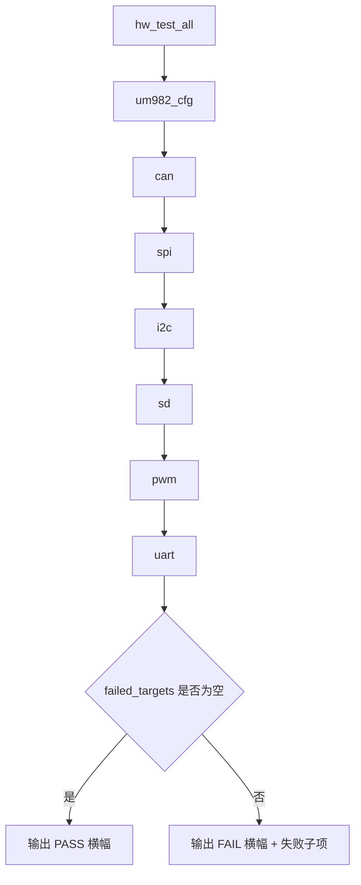
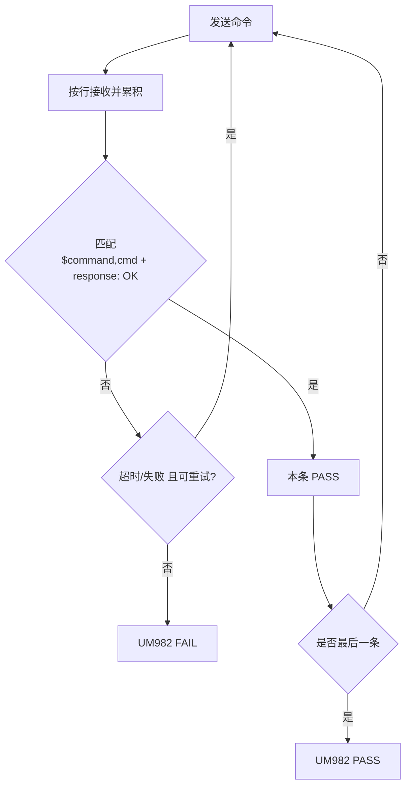

# ICF6 `hw_test` 测试流程与逻辑（细化版）

本文档用于产测和问题定位，覆盖 `hw_test` 各测试项的**前置条件、执行步骤、判定规则、典型失败特征**。

## 1. 命令入口

- 单项：`hw_test <target>`
- 全项：`hw_test_all`
- UM982：`hw_test um982_cfg [dev] [baud]`
  - 默认 `dev=/dev/ttyS1`（TELEM2）
  - 默认 `baud=115200`（飞控侧与模块交互波特率）

## 2. `hw_test_all` 顺序

当前顺序：

1. `um982_cfg`
2. `can`
3. `spi`
4. `i2c`
5. `sd`
6. `pwm`
7. `uart`

任一子项失败会记录到失败列表，最终统一输出 `HW_TEST ALL: PASS/FAIL`。

## 3. `um982_cfg` 测试（UM982 配置）

### 3.1 前置条件

- UM982 接在 `/dev/ttyS1`（或命令行指定端口）
- 串口参数 115200, 8N1
- 允许模块在复位后输出插播信息（如 `$devicename,COM2`）

### 3.2 命令步骤（固定顺序）

1. `FRESET`
2. `config com1 230400`
3. `GPGGA COM1 0.2`
4. `GPRMC COM1 0.2`
5. `AGRICA COM1 0.2`
6. `GPGSA COM1 0.2`
7. `GPGST COM1 0.2`
8. `UNIHEADINGA COM1 0.4`
9. `saveconfig`

### 3.3 判定逻辑

- 每条命令打印 `UM982 tx: ...`
- 接收按行打印 `UM982 rx: ...`
- 每条命令 PASS 条件：
  - 接收窗口内出现 `response: OK`
  - 且同一缓存中出现 `$command,<当前命令>`（防残包误判）

### 3.4 稳定性设计（不断电重复测试）

- 每条发送前先做短排空 + `TCIFLUSH`
- `FRESET` / `config com1 230400` / `saveconfig` 支持一次重试
- `config com1 230400` 成功后有专门等待+排空窗口，吞掉尾包（`*01`、`$devicename,COM2`）再发下一条

### 3.5 失败特征

- `zero RX bytes`：链路无回包（接线/端口/占用）
- `no substring response: OK`：收到数据但未匹配本命令 OK（常见于插播残包/时序）

## 4. `can` 测试

### 4.1 前置条件

- `can0` 与 `can1` 外部短接（H-H, L-L, GND）
- 终端阻抗正确（典型总线约 60 欧）

### 4.2 执行步骤

1. 拉起接口（`IFF_UP`）
2. 可选重初始化接口（清理控制器状态）
3. 执行双向互测：
   - `can0 -> can1`
   - `can1 -> can0`

### 4.3 判定逻辑

- 帧类型：扩展帧（29bit），固定 ID 与 8 字节载荷
- 每个方向：发送后在超时窗口内必须收到**同 ID + 同 payload**
- 每方向支持重试（默认 3 次）
- 两个方向都成功才 PASS

### 4.4 典型失败

- `recv timeout`：总线无 ACK / 接线错误 / 终端问题
- `bind/ioctl failed`：接口名或底层驱动状态异常

## 5. `spi` 测试

### 5.1 前置条件

- BMI088 与 ICM42688P 驱动已在系统中运行
- FRAM 路径 `/fs/mtd_params` 可访问

### 5.2 执行步骤

1. 在 2s 窗口内采集 `vehicle_imu`、`sensor_accel`、`sensor_gyro`
2. 识别四路设备：
   - BMI088 accel/gyro
   - ICM42688P accel/gyro
3. 检查四路“新鲜度”是否都在 200ms 内
4. 打开 FRAM 文件验证可访问
5. 若 error_count 基线完整，检查增量必须为 0

### 5.3 判定逻辑

- 任一路缺失/不新鲜/error_count 增长 => FAIL
- 全部满足 => PASS

## 6. `i2c` 测试

### 6.1 前置条件

- 编译使能 `CONFIG_DRIVERS_IMU_BOSCH_BMI088_I2C`

### 6.2 执行步骤

1. 在 bus1 启动 BMI088 I2C accel（`-A -X -b 1 -R 4 start`）
2. 稳定等待后 stop
3. 在 bus4 重复相同步骤

### 6.3 判定逻辑

- bus1 与 bus4 启动都成功 => PASS
- 任一启动失败 => FAIL（打印 `I2C FAIL busX`）

## 7. `sd` 测试

### 7.1 执行步骤

- 运行 `sd_bench -b 4096 -r 2 -d 1000`

### 7.2 判定逻辑

- `sd_bench_main()` 返回 0 => PASS
- 非 0 => FAIL（附返回码）

## 8. `pwm` 测试

### 8.1 主路径

1. `up_pwm_servo_init(mask)` 初始化 PWM
2. arm 输出
3. 探测有效通道（能成功 `set` 到 1000us 的通道）
4. 逐通道点亮序列：当前通道 2000us，其它 1000us
5. 全通道回到 1000us 并 disarm

### 8.2 回退路径

- 若 PWM init 失败：
  - ICF6 优先 GPIO 高电平序列回退
  - 否则走 `actuator_test` 话题回退

### 8.3 判定逻辑

- 主路径或任一回退路径成功即 PASS
- 全部失败才 FAIL

## 9. `uart` 测试

### 9.1 回环端口测试

端口：

- `/dev/ttyS0`
- `/dev/ttyS3`
- `/dev/ttyS4`
- `/dev/ttyS5`

说明：`/dev/ttyS1` 已移除回环（用于 UM982）。

步骤与判定：

1. RAW 8N1 115200
2. 发送 32 字节固定文本
3. 规定时间内读回并 `memcmp` 一致
4. 每口最多重试 3 次

### 9.2 `/dev/ttyS2`（GPS 状态法）

不做回环，改为通过 `sensor_gps` 判定链路：

- 能订阅并收到更新
- `device_id` 是 SERIAL
- `bus == 2`（ICF6 上对应 `/dev/ttyS2`）
- 数据时间戳新鲜（未超时）

并额外打印：

- `UART /dev/ttyS2 gps status: OK`
- 或 `UART /dev/ttyS2 gps status: NOT OK`

## 10. 输出规范

- 子项通过：`[PASS] <TEST_NAME> ...`
- 子项失败：`[FAIL] <TEST_NAME> ...`
- 全流程最终输出汇总 PASS/FAIL 横幅与失败列表

## 11. 产测执行建议

1. 优先用 `hw_test_all` 跑全流程
2. 出现 UM982 偶发失败时，先看 `UM982 tx/rx` 是否匹配同一命令
3. UART 的 `/dev/ttyS2` 以 GPS 状态判定，不等同回环测试
4. 连续跑批（不断电）建议记录每轮失败项，观察是否固定集中在单一子项
